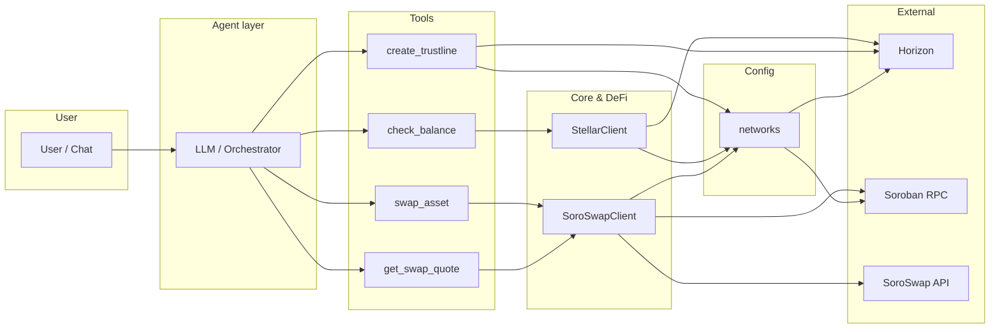
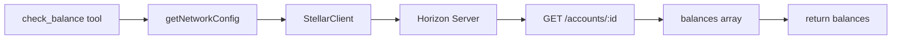
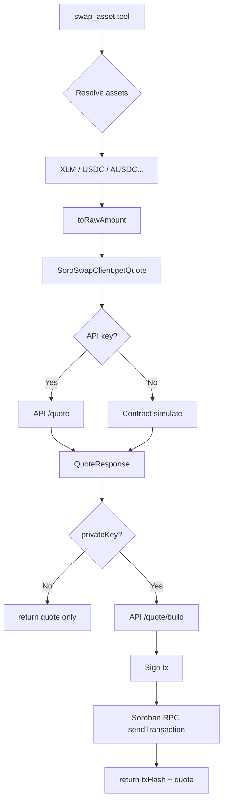
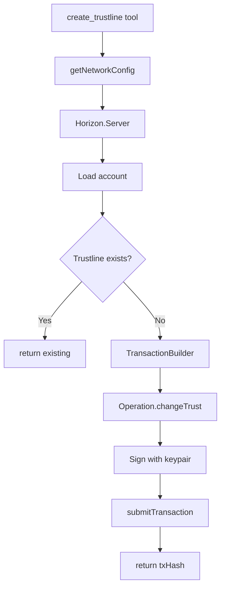
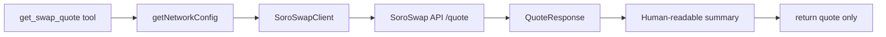
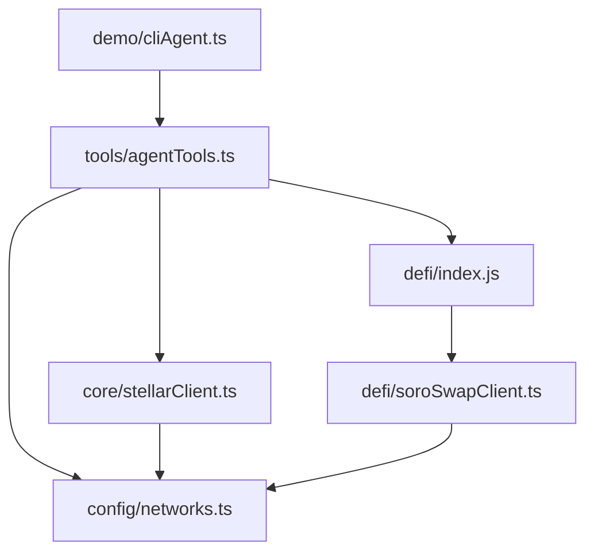

# Stellar DeFi Agent Kit — Flowchart & Progress

High-level plan and current progress for the hackathon agent kit.

---

## 1. Overall architecture (current)

---

## 2. Progress: what’s done vs what’s next

```mermaid
flowchart TB
    subgraph Done["✅ Done"]
        D1[config/networks.ts]
        D2[core/stellarClient.ts]
        D3[defi/soroSwapClient.ts]
        D4[tools/agentTools.ts]
        D5[create_trustline]
        D6[get_swap_quote]
        D7[Agent loop + CLI]
        D8[Mainnet RPC Gateway]
    end

    subgraph Next["🔲 Optional"]
        N1[send_payment tool]
        N2[Tests & README]
    end

    D1 --> D2
    D1 --> D3
    D2 --> D4
    D3 --> D4
    D4 --> D5
    D4 --> D6
    D4 --> D7
    D1 --> D8
```

---

## 3. check_balance flow

---

## 4. swap_asset flow

---

## 5. create_trustline flow

---

## 6. get_swap_quote flow

---

## 7. Module dependency map

---

## 8. Legend

| Symbol | Meaning |
|--------|--------|
| ✅ Done | Implemented and in repo |
| 🔲 Optional | Possible next steps |
| Agent layer | LLM/orchestrator (CLI loop) that chooses and calls tools |
| Tools | check_balance, swap_asset, create_trustline, get_swap_quote |
| Mainnet RPC | Gateway URL (`soroban-rpc.mainnet.stellar.gateway.fm`) |

---

## 9. Suggested next steps (optional)

1. **send_payment** — Tool wrapping `StellarClient.sendPayment` for simple XLM/asset transfers.
2. **Tests** — Unit tests for tools and SoroSwap client.
3. **README** — Update with agent usage, env vars (`GROQ_API_KEY`, `SOROSWAP_API_KEY`), and mainnet vs testnet.
