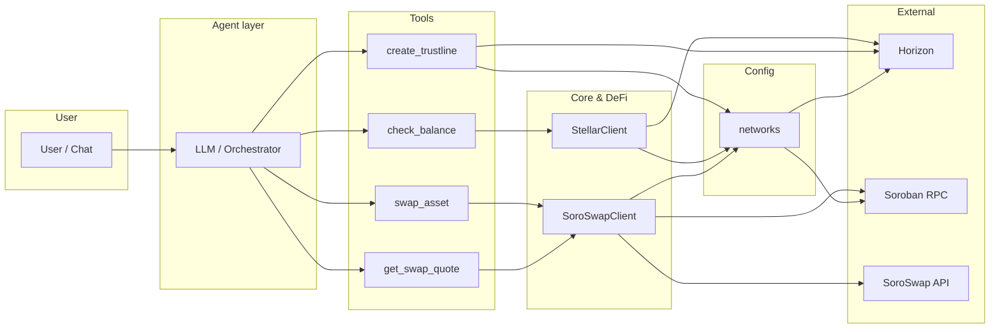
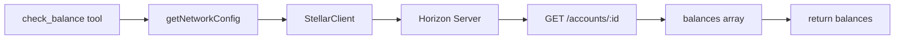
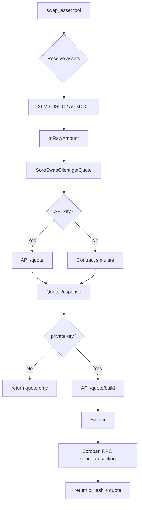
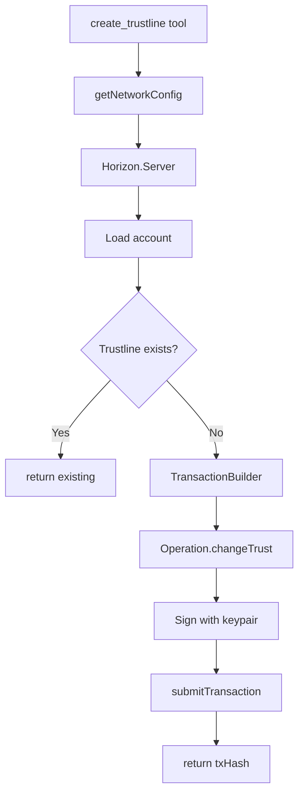
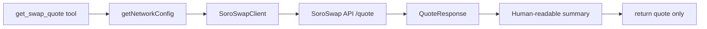
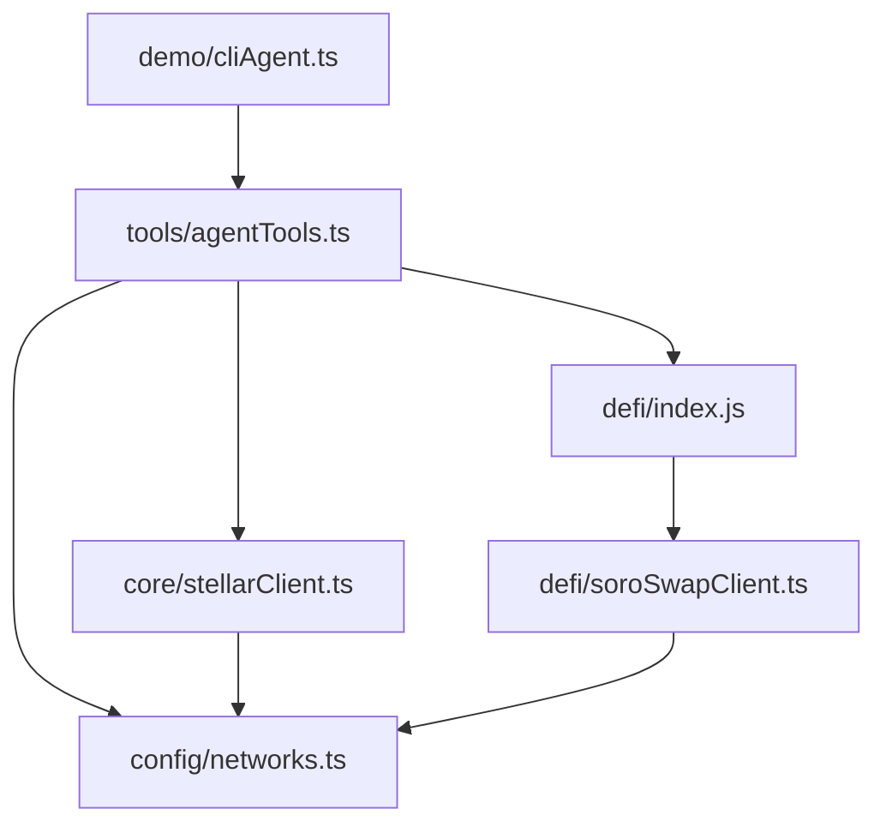

# Stellar DeFi Agent Kit — Flowchart & Progress

High-level plan and current progress for the hackathon agent kit. Last updated to reflect shipped packages, Warly UI (DevKit, Swap, Send, MCP), and comparison to [Mantle DevKit](https://github.com/Debanjannnn/mantle-devkit).

---

## 1. Overall architecture (current)

---

## 2. Progress: what’s done vs what’s next

### 2.1 Current progress (shipped)

```mermaid
flowchart TB
    subgraph Packages["✅ Published packages"]
        P1[stellar-agent-kit]
        P2[x402-stellar-sdk]
        P3[create-stellar-devkit-app]
        P4[stellar-devkit-mcp]
    end

    subgraph SDK["✅ stellar-agent-kit"]
        S1[StellarAgentKit + initialize]
        S2[dexGetQuote / dexSwap / dexSwapExactIn]
        S3[sendPayment]
        S4[MAINNET_ASSETS, TESTNET_ASSETS, getNetworkConfig]
        S5[createDexClient - SoroSwap aggregator]
    end

    subgraph CLI["✅ Root CLI (src/)"]
        C1[balance command]
        C2[pay command]
        C3[agent command]
        C4[Tools: check_balance, swap_asset, get_swap_quote, create_trustline]
    end

    subgraph MCP["✅ stellar-devkit-mcp"]
        M1[ListTools / CallTool]
        M2[get_stellar_contract]
        M3[get_sdk_snippet]
        M4[Resources - stellar://]
    end

    subgraph UI["✅ Warly UI (ui/)"]
        U1[Landing + Wallet Freighter]
        U2[Swap - quote/build/sign/submit]
        U3[Send - build/sign/submit]
        U4[DevKit: Overview project+key, Protocols, Code generator, MCP tab]
        U5[API: /swap/*, /send/*, /balance, /api/v1/validate]
    end

    subgraph Scaffolder["✅ create-stellar-devkit-app"]
        SC1[agent-kit template]
        SC2[x402-api template]
    end

    Packages --> SDK
    Packages --> MCP
    Packages --> Scaffolder
    SDK --> CLI
    UI --> U5
```

### 2.2 Optional / not yet

| Area | Status | Notes |
|------|--------|-------|
| Lending, oracles | ✅ Done | Reflector oracle, Blend lending in SDK |
| Cross-chain | 🔲 Optional | External services only; not in SDK |
| send_payment **tool** in agent | ✅ Done | CLI agent has send_payment tool |
| Unit tests | 🔲 Recommended | For tools, SDK, API routes |
| In-browser agent chat | 🔲 Optional | CLI agent exists; no chat UI in app |

---

## 3. check_balance flow

---

## 4. swap_asset flow

---

## 5. create_trustline flow

---

## 6. get_swap_quote flow

---

## 7. Module dependency map

---

## 8. Legend

| Symbol | Meaning |
|--------|--------|
| ✅ Done | Implemented and in repo |
| 🔲 Optional | Possible next steps |
| Agent layer | LLM/orchestrator (CLI loop) that chooses and calls tools |
| Tools | check_balance, swap_asset, create_trustline, get_swap_quote |
| Mainnet RPC | Gateway URL (`soroban-rpc.mainnet.stellar.gateway.fm`) |

---

## 9. Comparison to Mantle DevKit

[Mantle DevKit](https://github.com/Debanjannnn/mantle-devkit) is a developer suite for Mantle Network (EVM): x402 payments, Agent Kit SDK, CLI scaffolder, and MCP. Below is how close the Stellar Agent Kit has come to that shape.

| Dimension | Mantle DevKit | Stellar Agent Kit | Parity |
|-----------|----------------|-------------------|--------|
| **Packages** | x402-mantle-sdk, mantle-agent-kit-sdk, create-mantle-devkit-app, mantle-devkit-mcp | x402-stellar-sdk, stellar-agent-kit, create-stellar-devkit-app, stellar-devkit-mcp | ✅ Same 4-package layout |
| **x402** | Server + client, Hono/Express/Next, 402 + payment flow | Server + client, Hono/Next, 402 + Stellar verification | ✅ Equivalent |
| **Agent Kit SDK** | MNTAgentKit: DEX (Agni, OpenOcean, OKX), Lending (Lendle), cross-chain (Squid), Pyth oracles, perps (PikePerps), token/NFT launchpad | StellarAgentKit: DEX (SoroSwap aggregator: SoroSwap, Phoenix, Aqua), sendPayment, config | ⚠️ DEX + payments done; no lending, oracles, cross-chain, perps, launchpad |
| **Scaffolder** | Agent Kit + x402 templates | agent-kit + x402-api templates | ✅ Same idea |
| **MCP** | Claude integration, protocol/SDK context | Cursor/Claude, get_stellar_contract, get_sdk_snippet, resources | ✅ Same role; 2 tools + resources |
| **Dashboard / DevKit UI** | Project creation, APP_ID, protocol explorer, code generator (mantle.dev-kit.xyz) | DevKit: project creation, APP Id + API endpoint, Protocols tab, Code generator tab, MCP tab | ✅ Same flow: project → key → protocols → code |
| **DeFi scope** | DEX aggregators + native DEXs, lending, cross-chain, oracles, perps, token/NFT launchpad | DEX aggregator (SoroSwap/Phoenix/Aqua), native send | ⚠️ Fewer protocols; Stellar ecosystem is different (Soroban vs EVM) |

**Summary:** We match Mantle’s **structure** (four packages, x402, Agent Kit SDK, scaffolder, MCP, DevKit-style UI with project/key, protocols, code generator). We are **close** on developer experience and surface area. The gap is **breadth of DeFi**: Mantle has lending, oracles, cross-chain, perps, and launchpads; we have DEX aggregator + payments and a pluggable design to add more later.

---

## 10. Suggested next steps (optional)

1. **send_payment tool** — Expose `StellarClient.sendPayment` as an agent tool (CLI agent already has `pay` command).
2. **Tests** — Unit tests for tools, SoroSwap client, and API routes.
3. **README / docs** — Keep GETTING_STARTED, DEVKIT_README, and root README in sync with agent usage, env vars (`GROQ_API_KEY`, `SOROSWAP_API_KEY`), and MCP (new chat, local path).
